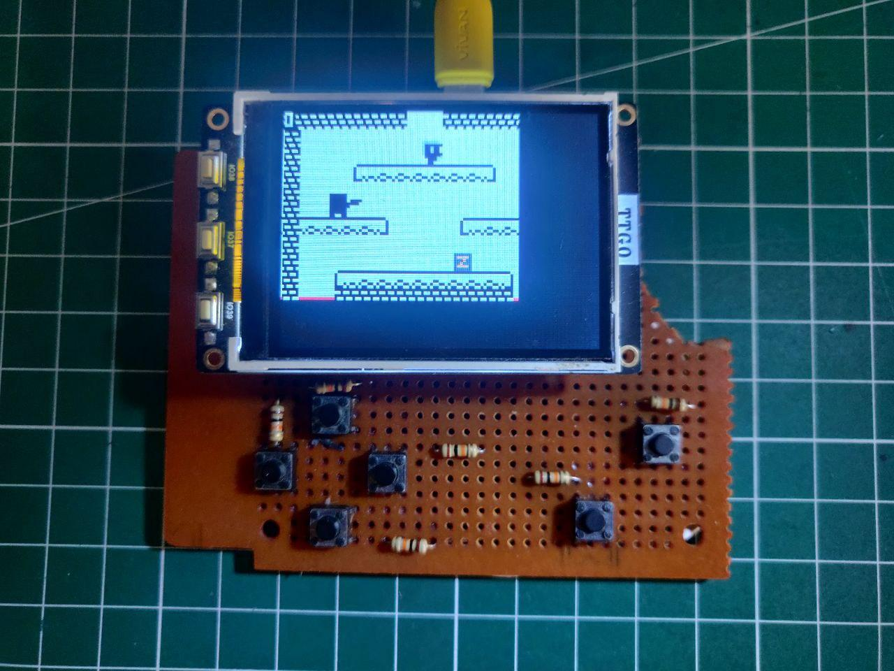

# gamebuino-esp32

This is an ESP32 Port for Handheld Game Console Gamebuino META which is originally based on ATSAMD51.

Ported to ESP32 TTGO T4 v1.3 with ILI9341 LCD Display

# Why Port to ESP32?
Because I want to play Gamebuino META games and I don't have physical Gamebuino META. But I do have an ESP32 laying around, and it is a good exercise to do.

# What Part that is working?
I've already done some initial porting effort, and thanks to Gamebuino META great modularity, I only need to port most low-level parts.

I've ported these parts:
* Display
* Keypad
* Audio (although it is not as smooth as the original)
* SD Card

# What Is Your Next Plan?
* Improve display rendering performance by enabling DMA
* Add Multiplayer support through WiFi/Bluetooth
* Port Game Loader
